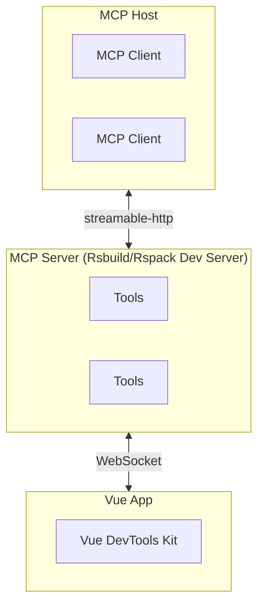

# Rsbuild plugin VueDevtools MCP

Language / 语言: [English](README.md) | [中文](README_zh.md)

> Rsbuild/Rspack MCP plugin based on Vue DevTools.
>
> Supported `Rsbuild 1.x/2.x` and `Rspack 1.x/2.x` .

Through the Model Context Protocol (MCP), AI tools can read and manipulate your Vue application state in real time,
truly enabling "AI that understands your application."

## Usage

### Install

```bash
# For npm
npm add rsbuild-plugin-vue-mcp -D

# For yarn
yarn add rsbuild-plugin-vue-mcp -D

# For pnpm
pnpm add rsbuild-plugin-vue-mcp -D
```

In Rsbuild:

```js
// rsbuild.config.js
import { defineConfig } from '@rsbuild/core';
import { pluginVue } from '@rsbuild/plugin-vue';
import { pluginVueMcp } from "rsbuild-plugin-vue-mcp";

export default defineConfig({
    plugins: [
        pluginVue(),
        pluginVueMcp(),
    ],
});

```

In Rspack:

```js
// rspack.config.js
import { defineConfig } from '@rspack/cli';
import { rspack } from "@rspack/core";
import { VueLoaderPlugin } from 'rspack-vue-loader';
import { VueMcpPlugin } from 'rsbuild-plugin-vue-mcp/rspack';

export default defineConfig({
    plugins: [
        new rspack.HtmlRspackPlugin(),
        new VueLoaderPlugin(),
        new VueMcpPlugin(),
    ],
    module: {
        rules: [
            {
                test: /\.vue$/,
                loader: 'rspack-vue-loader',
                options: {
                    experimentalInlineMatchResource: true,
                },
            },
        ],
    },
});

```

Then the MCP server will be available at `http://localhost:[port]/__mcp/mcp` .

### Config MCP

First, start the development server, typically with `npm run dev`, which will print the MCP service URL address in the
console. Then, add that address to your MCP service configuration.

```json
{
  "mcpServers": {
    "vue-mcp": {
      "type": "streamable-http",
      "url": "http://localhost:<YourPort>/__mcp/mcp",
      "disabled": false
    }
  }
}
```

## 工作原理



## Reference

Debugging MCP servers：[MCP Inspector](https://modelcontextprotocol.io/docs/tools/inspector) .

```bash
npx @modelcontextprotocol/inspector
```

