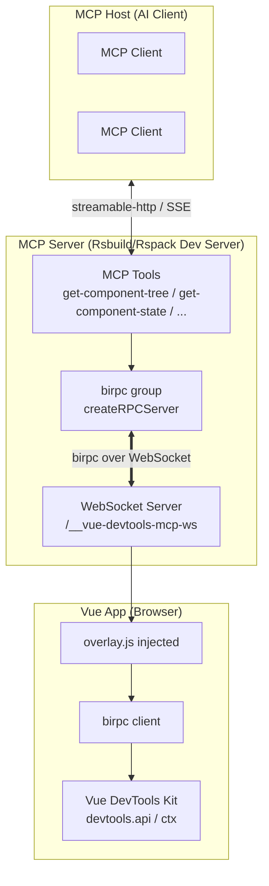

# Rsbuild plugin VueDevtools MCP

Language / 语言: [English](README.md) | [中文](README_zh.md)

> Rsbuild/Rspack MCP plugin based on Vue DevTools.
>
> Supports `Rsbuild 1.x/2.x` and `Rspack 1.x/2.x`.

Through the [Model Context Protocol (MCP)](https://modelcontextprotocol.io), AI tools (such as IDE assistants and
agents) can read and manipulate your Vue application state in real time, truly enabling "AI that understands your
application."

This plugin bridges your dev server and the Vue DevTools running inside your app page via **birpc over WebSocket**,
exposing a set of MCP tools that let AI inspect components, router, and Pinia stores, and even edit component state
directly.

## Features

- 🔌 **Zero-config MCP server** — automatically mounted on your existing dev server (no separate process).
- 🌳 **Inspect the component tree** of the running app, in tree.
- 🧩 **Read & edit Vue component state** (reactive data, props, computed, refs…).
- 🔦 **Highlight a component** in the page to visually locate it.
- 🧭 **Read the Vue Router** info (current route, matched records, params, query…).
- 🗄️ **Inspect Pinia** — browse the store tree and read individual store state.
- ⚡️ Works with both **Rsbuild** and **Rspack** dev servers.

## Usage

### Install

```bash
# For npm
npm add rsbuild-plugin-vue-mcp -D

# For yarn
yarn add rsbuild-plugin-vue-mcp -D

# For pnpm
pnpm add rsbuild-plugin-vue-mcp -D
```

### Rsbuild

```js
// rsbuild.config.js
import { defineConfig } from '@rsbuild/core';
import { pluginVue } from '@rsbuild/plugin-vue';
import { pluginVueMcp } from "rsbuild-plugin-vue-mcp";

export default defineConfig({
    plugins: [
        pluginVue(),
        pluginVueMcp(),
    ],
});

```

### Rspack

```js
// rspack.config.js
import { defineConfig } from '@rspack/cli';
import { rspack } from "@rspack/core";
import { VueLoaderPlugin } from 'rspack-vue-loader';
import { VueMcpPlugin } from 'rsbuild-plugin-vue-mcp/rspack';

export default defineConfig({
    plugins: [
        new rspack.HtmlRspackPlugin(),
        new VueLoaderPlugin(),
        new VueMcpPlugin(),
    ],
    module: {
        rules: [
            {
                test: /\.vue$/,
                loader: 'rspack-vue-loader',
                options: {
                    experimentalInlineMatchResource: true,
                },
            },
        ],
    },
});

```

The MCP server (Streamable HTTP transport) will be available at `http://localhost:[port]/__mcp/mcp`.

> Requirements: requires `@rsbuild/core >= 1.2.9` (for Rsbuild) or `@rspack/core >= 1.3.0` (for Rspack) so the plugin
> can attach to the underlying HTTP server.

### Connect an MCP client

Start the dev server (usually `npm run dev`). It prints the MCP service URL in the console, e.g.:

```
➜  MCP:     Server is running at http://localhost:5173/__mcp/mcp
```

Add that URL to your client's MCP configuration (Cursor, Claude Desktop, VS Code, etc.):

```json
{
  "mcpServers": {
    "vue-devtools": {
      "type": "streamable-http",
      "url": "http://localhost:<YourPort>/__mcp/mcp",
      "description": "Vue DevTools MCP - Rsbuild/Rspack MCP plugin based on Vue DevTools",
      "disabled": false
    }
  }
}
```

> [!IMPORTANT]
> To actually call the MCP tools and debug your app, **two things are required**:
> 1. The dev server is running (so the MCP server is up).
> 2. You have **opened your app page in a browser** (e.g. `http://localhost:5173`). The injected `overlay.js` then
     connects to the dev server via WebSocket and exposes the Vue DevTools runtime.
>
> The tools reach the *live* app through that WebSocket connection — if no app page is open, the tool calls will fail or
> time out.

Once the page is open, the AI assistant can call the tools listed below against your running dev app.

## MCP Tools

The plugin registers the following tools on the MCP server. Each tool talks to the app page through birpc, so the data
always reflects the **live** application. All tools return their results as **JSON-formatted text** (not markdown).

| Tool                   | Description                                                                       | Inputs                                                                                                                            |
|------------------------|-----------------------------------------------------------------------------------|-----------------------------------------------------------------------------------------------------------------------------------|
| `get-component-tree`   | Get the Vue component tree. The result is returned as a **JSON** text payload.    | —                                                                                                                                 |
| `get-component-state`  | Get a component's state as JSON (data, props, computed, refs…).                   | `componentName: string`                                                                                                           |
| `edit-component-state` | Edit a value inside a component's state (live, reactive).                         | `componentName: string`, `path: string[]`, `value: string`, `valueType: 'string' \| 'number' \| 'boolean' \| 'object' \| 'array'` |
| `highlight-component`  | Highlight a component on the page (auto-clears after 5s).                         | `componentName: string`                                                                                                           |
| `get-router-info`      | Get the current Vue Router info as JSON (route, matched records, params, query…). | —                                                                                                                                 |
| `get-pinia-tree`       | Get the Pinia store tree as JSON.                                                 | —                                                                                                                                 |
| `get-pinia-state`      | Get a single Pinia store's state as JSON.                                         | `storeName: string`                                                                                                               |

### Example AI workflow

- "Show me the component tree of the current page."
- "What is the state of the `UserCard` component?"
- "Set `count` in `Counter` to `10`." → calls `edit-component-state` and the UI updates instantly.
- "Highlight the `Navbar` component." → the element flashes in the browser.
- "What route are we on and what are its params?" → calls `get-router-info`.
- "Show me the state of the `cart` Pinia store."

## How it works

The plugin uses **birpc** as the RPC layer and **WebSocket** as the transport between the dev server and the app page.



1. **Injection** — When the dev server starts, the plugin injects `overlay.js` into the app's HTML (or, when `appendTo`
   is configured, appends an import to matching source modules). `overlay.js` initializes `@vue/devtools-kit` and opens
   a `WebSocket` to the dev server at `/__vue-devtools-mcp-ws`.
2. **RPC bridge** — The dev server creates a birpc group (`createRPCServer`) over the WebSocket connections.
   `overlay.js` creates a birpc client (`createBirpc`). Requests from the server are forwarded to the app; responses
   come back via hook callbacks (`onInspectorTreeUpdated`, `onInspectorStateUpdated`, …).
3. **MCP layer** — MCP tool handlers (`src/mcp/server.ts`) call the birpc client to reach the app, wait for the response
   through `hookable` hooks, and return it as the tool result.

This two-hop design (MCP ↔ birpc ↔ DevTools) means every tool call inspects or mutates the **actual running application
**, not a static snapshot.

## Configuration

Both `pluginVueMcp(options)` (Rsbuild) and `new VueMcpPlugin(options)` (Rspack) accept the same options:

```ts
interface PluginVueMcpOptions {
    /** Host to listen on. Default: `localhost`. */
    host?: string

    /** Print the MCP server URL in the console. Default: `true`. */
    printUrl?: boolean

    /** Custom MCP server info (name/version). Ignored when `mcpServer` is provided. */
    mcpServerInfo?: { name?: string, version?: string, ... }

    /**
     * Customize or replace the MCP server instance. Called whenever a server is created.
     * You may register extra tools, or return a new McpServer to replace the default one.
     */
    mcpServerSetup?: (server: McpServer, api: RsbuildPluginAPI | Compiler) => void | Promise<void | McpServer>

    /** Path prefix for the MCP endpoint. Default: `/__mcp` (so the endpoint is `/__mcp/mcp`). */
    mcpPath?: string

    /**
     * Instead of injecting a <script> into HTML, append an import to modules whose id
     * matches this regex. Useful for projects without an HTML entry.
     * WARNING: only set this if you know exactly what it does.
     */
    appendTo?: string | RegExp
}
```

### Examples

Register extra MCP tools alongside the defaults:

```js
pluginVueMcp({
    mcpServerSetup(server, api) {
        server.registerTool('ping', { description: 'Ping the dev server' }, async () => ({
            content: [{ type: 'text', text: 'pong' }],
        }))
    },
})
```

Use a custom MCP endpoint path:

```js
pluginVueMcp({ mcpPath: '/my-mcp' })
// → http://localhost:<port>/my-mcp/mcp
```

## Requirements

- Node.js `>= 18`
- `@rsbuild/core >= 1.2.9 || >= 2.0.0` (optional peer, for the Rsbuild plugin)
- `@rspack/core >= 1.3.0 || >= 2.0.0` (optional peer, for the Rspack plugin)
- A Vue 3 application instrumented with `@vue/devtools-kit` (handled automatically by the injected overlay).

## Debugging

You can inspect the MCP server with the official [MCP Inspector](https://modelcontextprotocol.io/docs/tools/inspector):

```bash
npx @modelcontextprotocol/inspector
```

Then point it at `http://localhost:<YourPort>/__mcp/mcp` with the Streamable HTTP transport.

## Reference / Credits

- Inspired by [vite-plugin-vue-mcp](https://github.com/webfansplz/vite-plugin-vue-mcp) — the original idea of bridging
  Vue DevTools and MCP.
- [Model Context Protocol](https://modelcontextprotocol.io)
- [`birpc`](https://github.com/antfu/birpc) — the RPC layer used between dev server and app page
- [`@vue/devtools-kit`](https://github.com/vuejs/devtools-next) — Vue DevTools core API

## License

[MIT](./LICENSE)
