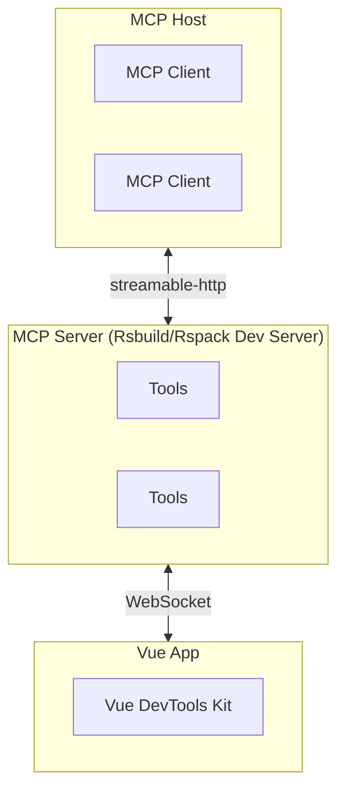

# Rsbuild plugin VueDevtools MCP

Language / 语言: [English](README.md) | [中文](README_zh.md)

> 基于 Vue Devtools 的 Rsbuild/Rspack MCP 插件。
>
> 支持 `Rsbuild 1.x/2.x` 和 `Rspack 1.x/2.x` 。

通过 Model Context Protocol (MCP) 协议，让 AI 工具能够实时读取和操作你的 Vue 应用状态，真正实现了"AI 理解你的应用"。

## 使用

### 安装

```bash
# For npm
npm add rsbuild-plugin-vue-mcp -D

# For yarn
yarn add rsbuild-plugin-vue-mcp -D

# For pnpm
pnpm add rsbuild-plugin-vue-mcp -D
```

In Rsbuild:

```js
// rsbuild.config.js
import { defineConfig } from '@rsbuild/core';
import { pluginVue } from '@rsbuild/plugin-vue';
import { pluginVueMcp } from "rsbuild-plugin-vue-mcp";

export default defineConfig({
    plugins: [
        pluginVue(),
        pluginVueMcp(),
    ],
});

```

In Rspack:

```js
// rspack.config.js
import { defineConfig } from '@rspack/cli';
import { rspack } from "@rspack/core";
import { VueLoaderPlugin } from 'rspack-vue-loader';
import { VueMcpPlugin } from 'rsbuild-plugin-vue-mcp/rspack';

export default defineConfig({
    plugins: [
        new rspack.HtmlRspackPlugin(),
        new VueLoaderPlugin(),
        new VueMcpPlugin(),
    ],
    module: {
        rules: [
            {
                test: /\.vue$/,
                loader: 'rspack-vue-loader',
                options: {
                    experimentalInlineMatchResource: true,
                },
            },
        ],
    },
});

```

然后 MCP 服务器将在 `http://localhost:[port]/__mcp/mcp` 上可用。

### 接入 MCP

先启动开发服务器，通常是 `npm run dev`，会在控制台打印 MCP 服务 url 地址，然后将地址添加到你的 MCP 服务配置里：

```json
{
  "mcpServers": {
    "vue-mcp": {
      "type": "streamable-http",
      "url": "http://localhost:<YourPort>/__mcp/mcp",
      "disabled": false
    }
  }
}
```

## 工作原理



## 其他

MCP 服务调试工具：[MCP Inspector](https://modelcontextprotocol.io/docs/tools/inspector) .

```bash
npx @modelcontextprotocol/inspector
```

