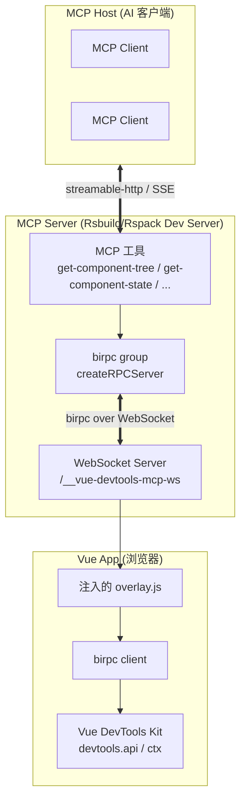

# Rsbuild plugin VueDevtools MCP

Language / 语言: [English](README.md) | [中文](README_zh.md)

> 基于 Vue DevTools 的 Rsbuild/Rspack MCP 插件。
>
> 支持 `Rsbuild 1.x/2.x` 和 `Rspack 1.x/2.x` 。

通过 [Model Context Protocol (MCP)](https://modelcontextprotocol.io) 协议，让 AI 工具（如 IDE 助手、智能体）能够实时读取和操作你的
Vue 应用状态，真正实现了"AI 理解你的应用"。

本插件通过 **基于 WebSocket 和 birpc** 打通 dev server 与运行在 App 页面中的 Vue DevTools，并将交互封装成一组 MCP 工具，供
AI 调用和调试。

## 功能特性

- 🔌 **零配置 MCP 服务** —— 直接挂载在你现有的 dev server 上（无需额外进程）。
- 🌳 **查看组件树** —— 以树形输出运行中的应用组件结构。
- 🧩 **读取 & 编辑组件状态** —— 直接修改 reactive 数据、props、computed、ref 等。
- 🔦 **高亮组件** —— 在页面中高亮某个组件，方便定位。
- 🧭 **读取 Vue Router 信息** —— 当前路由、匹配记录、params、query 等。
- 🗄️ **查看 Pinia** —— 浏览 store 树、读取单个 store 的状态。
- ⚡️ 同时支持 **Rsbuild** 与 **Rspack** 的 dev server。

## 使用

### 安装

```bash
# For npm
npm add rsbuild-plugin-vue-mcp -D

# For yarn
yarn add rsbuild-plugin-vue-mcp -D

# For pnpm
pnpm add rsbuild-plugin-vue-mcp -D
```

### Rsbuild

```js
// rsbuild.config.js
import { defineConfig } from '@rsbuild/core';
import { pluginVue } from '@rsbuild/plugin-vue';
import { pluginVueMcp } from "rsbuild-plugin-vue-mcp";

export default defineConfig({
    plugins: [
        pluginVue(),
        pluginVueMcp(),
    ],
});

```

### Rspack

```js
// rspack.config.js
import { defineConfig } from '@rspack/cli';
import { rspack } from "@rspack/core";
import { VueLoaderPlugin } from 'rspack-vue-loader';
import { VueMcpPlugin } from 'rsbuild-plugin-vue-mcp/rspack';

export default defineConfig({
    plugins: [
        new rspack.HtmlRspackPlugin(),
        new VueLoaderPlugin(),
        new VueMcpPlugin(),
    ],
    module: {
        rules: [
            {
                test: /\.vue$/,
                loader: 'rspack-vue-loader',
                options: {
                    experimentalInlineMatchResource: true,
                },
            },
        ],
    },
});

```

MCP 服务（基于 Streamable HTTP 传输）将在 `http://localhost:[port]/__mcp/mcp` 上可用。

> 环境要求：Rsbuild 需要 `@rsbuild/core >= 1.2.9`，Rspack 需要 `@rspack/core >= 1.3.0`，以便插件能够挂载到底层 HTTP 服务上。

### 接入 MCP

先启动开发服务器（通常是 `npm run dev`），控制台会打印 MCP 服务 URL，例如：

```
➜  MCP:     Server is running at http://localhost:5173/__mcp/mcp
```

将该 URL 配置到你的 MCP 客户端（Cursor、Claude Desktop、VS Code 等）中：

```json
{
  "mcpServers": {
    "vue-devtools": {
      "type": "streamable-http",
      "url": "http://localhost:<YourPort>/__mcp/mcp",
      "description": "Vue DevTools MCP - Rsbuild/Rspack MCP plugin based on Vue DevTools",
      "disabled": false
    }
  }
}
```

> [!IMPORTANT]
> 要真正调用 MCP 工具进行 AI 调试，**必须同时满足两个条件**：
> 1. 开发服务器正在运行（MCP 服务才处于可用状态）。
> 2. 你已经在浏览器中**打开了一个应用页面**（例如 `http://localhost:5173`）。注入的 `overlay.js` 会通过 WebSocket 连接到
     dev server，并暴露 Vue DevTools 运行时。
>
> 工具是通过该 WebSocket 连接去访问**正在运行的应用**的——如果没有打开任何页面，工具调用将会失败或超时。

连接并打开页面后，AI 助手即可针对你的运行中的应用调用下方列出的工具。

## MCP 工具

插件会在 MCP 服务上注册以下工具。每个工具都通过 birpc 与 App 页面通信，因此数据始终是**实时**的应用状态。所有工具返回的结果均为
**JSON 格式的文本**（不是 markdown）。

| 工具                     | 说明                                                  | 入参                                                                                                                             |
|------------------------|-----------------------------------------------------|--------------------------------------------------------------------------------------------------------------------------------|
| `get-component-tree`   | 获取 Vue 组件树。返回结果为 **JSON** 文本。                       | —                                                                                                                              |
| `get-component-state`  | 以 JSON 格式获取组件状态（data、props、computed、refs…）。         | `componentName: string`                                                                                                        |
| `edit-component-state` | 编辑组件状态中的某个值（实时、响应式）。                                | `componentName: string`、`path: string[]`、`value: string`、`valueType: 'string' \| 'number' \| 'boolean' \| 'object' \| 'array'` |
| `highlight-component`  | 在页面中高亮某个组件（5 秒后自动取消）。                               | `componentName: string`                                                                                                        |
| `get-router-info`      | 以 JSON 格式获取当前 Vue Router 信息（路由、匹配记录、params、query…）。 | —                                                                                                                              |
| `get-pinia-tree`       | 以 JSON 格式获取 Pinia store 树。                          | —                                                                                                                              |
| `get-pinia-state`      | 以 JSON 格式获取单个 Pinia store 的状态。                      | `storeName: string`                                                                                                            |

### AI 使用示例

- "展示一下当前页面的组件树。"
- "`UserCard` 组件现在的状态是什么？"
- "把 `Counter` 组件的 `count` 改成 `10`。" → 调用 `edit-component-state`，页面 UI 立即更新。
- "高亮一下 `Navbar` 组件。" → 浏览器中对应元素闪烁。
- "当前路由是什么，参数是什么？" → 调用 `get-router-info`。
- "看看 `cart` 这个 Pinia store 的状态。"

## 工作原理

插件使用 **birpc** 作为 RPC 层，使用 **WebSocket** 作为 dev server 与 App 页面之间的传输通道。



1. **注入**：dev server 启动时，插件将 `overlay.js` 注入到 App 的 HTML 中（或当配置了 `appendTo` 时，向匹配的源码模块追加
   import）。`overlay.js` 会初始化 `@vue/devtools-kit`，并与 dev server 在 `/__vue-devtools-mcp-ws` 建立 `WebSocket` 连接。
2. **RPC 桥接**：dev server 基于这些 WebSocket 连接创建 birpc group（`createRPCServer`），`overlay.js` 创建 birpc client（
   `createBirpc`）。来自服务端的请求转发到 App，响应通过 hook 回调（`onInspectorTreeUpdated`、`onInspectorStateUpdated` 等）回传。
3. **MCP 层**：MCP 工具处理函数（`src/mcp/server.ts`）调用 birpc client 触达 App，通过 `hookable` 的 hooks 等待响应，再作为工具结果返回。

这种两段式设计（MCP ↔ birpc ↔ DevTools）意味着每次工具调用都是检查或操作**真正运行中的应用**，而不是一份静态快照。

## 配置项

`pluginVueMcp(options)`（Rsbuild）与 `new VueMcpPlugin(options)`（Rspack）接受相同的配置：

```ts
interface PluginVueMcpOptions {
    /** 监听的主机。默认：`localhost`。 */
    host?: string

    /** 是否在控制台打印 MCP 服务 URL。默认：`true`。 */
    printUrl?: boolean

    /** 自定义 MCP 服务信息（名称/版本）。当提供 `mcpServer` 时会被忽略。 */
    mcpServerInfo?: { name?: string, version?: string, ... }

    /**
     * 自定义或替换 MCP 服务实例。在每次创建服务时调用。
     * 你可以注册额外的工具，或返回一个新的 McpServer 来替换默认实例。
     */
    mcpServerSetup?: (server: McpServer, api: RsbuildPluginAPI | Compiler) => void | Promise<void | McpServer>

    /** MCP 端点的路径前缀。默认：`/__mcp`（因此完整端点为 `/__mcp/mcp`）。 */
    mcpPath?: string

    /**
     * 不向 HTML 注入 <script>，而是向 id 匹配该正则的模块追加 import。
     * 适用于没有 HTML 入口的项目。
     * 警告：仅在明确了解其用途时设置。
     */
    appendTo?: string | RegExp
}
```

### 示例

在默认工具之外注册额外的 MCP 工具：

```js
pluginVueMcp({
    mcpServerSetup(server, api) {
        server.registerTool('ping', { description: 'Ping the dev server' }, async () => ({
            content: [{ type: 'text', text: 'pong' }],
        }))
    },
})
```

使用自定义的 MCP 端点路径：

```js
pluginVueMcp({ mcpPath: '/my-mcp' })
// → http://localhost:<port>/my-mcp/mcp
```

## 环境要求

- Node.js `>= 18`
- `@rsbuild/core >= 1.2.9 || >= 2.0.0`（可选 peer，Rsbuild 插件需要）
- `@rspack/core >= 1.3.0 || >= 2.0.0`（可选 peer，Rspack 插件需要）
- 经过 `@vue/devtools-kit` 注入的 Vue 3 应用（由注入的 overlay 自动完成）。

## 调试

可使用官方 [MCP Inspector](https://modelcontextprotocol.io/docs/tools/inspector) 检查 MCP 服务：

```bash
npx @modelcontextprotocol/inspector
```

然后选择 Streamable HTTP 传输方式，将地址指向 `http://localhost:<YourPort>/__mcp/mcp`。

## 相关链接

- 灵感来自 [vite-plugin-vue-mcp](https://github.com/webfansplz/vite-plugin-vue-mcp) —— 将 Vue DevTools 与 MCP 打通的原始创意。
- [Model Context Protocol](https://modelcontextprotocol.io)
- [`birpc`](https://github.com/antfu/birpc) —— dev server 与 App 页面之间使用的 RPC 层
- [`@vue/devtools-kit`](https://github.com/vuejs/devtools-next) —— Vue DevTools 核心 API

## 许可证

[MIT](./LICENSE)
